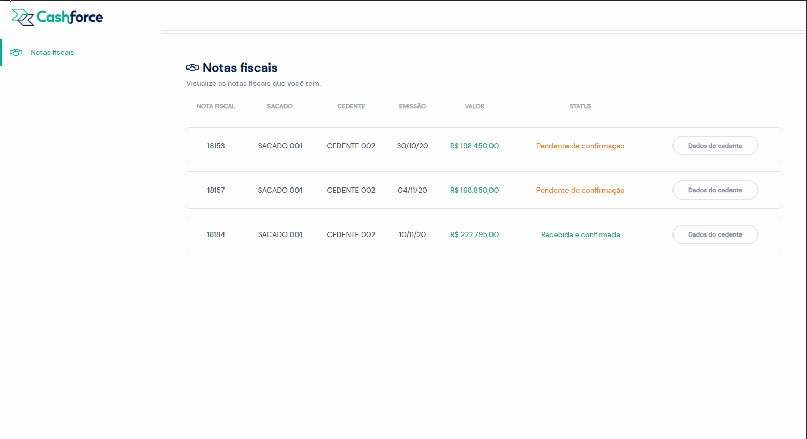

# Projeto Cashforce FullStack

O projeto consiste em um pequeno site, construido com Vue.js, seguindo um modelo do [figma](https://www.figma.com/file/m82rvaRyNaYV5VC4QcvaoZ/Teste-Cashfroce), cujo objetivo é possibilitar a consulta das informações de notas fiscais emitidas e o status da transação que foi realizada. O site recebe as informações de uma pequena API RESTful em Node.



## Back-End 🧱

<details>
  <summary>
    <strong>Tecnologias utilizadas 💻 </strong>
  </summary>
  <br/>
  
- **`Node + ExpressJs + Typescript`** para implementação da api, pensando na organização de modo a implementar a arquitetura **`MSC`**, também escolhi o *`TypeScript`* pois é bem útil na implementação de **`POO`**;
- **`ORM Sequelize`** para implementar de forma mais prática os Models, Queries e Associações, trazendo mais facilidade e versatilidade na hora de fazer as requisições para o banco de Dados;
- **`Decorators/Express`** para facilitar a implementação das rotas e também na manipulação dos elementos da requisição como `body, query e params`;
- **`Docker`** para trazer mais comodidade e facilidade na hora de rodar a aplicação.

</details>

<details>
  <summary>
    <strong>Retorno da API 📰 </strong>
  </summary>
  <br/>
  
- Ao fazer uma requisição do tipo GET para o endpoint `/invoices?userId=<id>`, onde `<id>` é o id do usuário que está fazendo a requisição.

  - Para testar use a url `http://localhost:3001/invoices?userId=1` ou clique [aqui](http://localhost:3001/invoices?userId=1). :grin:

- O retorno da requisição deverá ser:

<br/>

  ```json
    [
      {
        "id": 1,
        "nNf": "18153",
        "emissionDate": "2020-10-30T11:00:00-03:00",
        "value": "198450",
        "orderStatusBuyer": "0",
        "buyer": {
          "name": "SACADO 001"
        },
        "provider": {
          "name": "CEDENTE 002",
          "tradingName": "CEDENTE 002 LTDA",
          "cnpj": {
            "number": "00000000000002"
          }
        }
      },
      {
        "id": 2,
        "nNf": "18157",
        "emissionDate": "2020-11-04T15:32:35-02:00",
        "value": "168850",
        "orderStatusBuyer": "0",
        "buyer": {
          "name": "SACADO 001"
        },
        "provider": {
          "name": "CEDENTE 002",
          "tradingName": "CEDENTE 002 LTDA",
          "cnpj": {
            "number": "00000000000002"
          }
        }
      },
      {
        "id": 3,
        "nNf": "18184",
        "emissionDate": "2020-11-10",
        "value": "222795",
        "orderStatusBuyer": "7",
        "buyer": {
          "name": "SACADO 001"
        },
        "provider": {
          "name": "CEDENTE 002",
          "tradingName": "CEDENTE 002 LTDA",
          "cnpj": {
            "number": "00000000000002"
          }
        }
      }
    ]
  ```

</details>


## Front-End 🏕️

<details>
  <summary>
    <strong>Tecnologias utilizadas 💻</strong>
  </summary>
  <br/>
  
- **`VueJS + VueX`** para manipulação e estruturação da pagina, e também a manipulação de estados;
- **`TypeScript`** como linguagem base da aplicação, para poder ter uma maior tipagem;
- **`Bootstrap`** para uma estilização mais produtiva, porém foram feitos alguns ajustes com **`CSS`** vanilla;
- **`Axios`** para realizar as requisições de forma mais simples e intuitiva;
- **`Docker`** para trazer mais comodidade e facilidade na hora de rodar a aplicação.

</details>

<br/>
<hr/>
<br/>

#### *ATENÇÃO: _Para seguir o tutorial de instalação é necessário ter o Docker instalado, para mais orientações sobre essa ferramenta acesse [aqui](https://docs.docker.com/get-started/)._
<br/>
<hr/>
 
# Instalando aplicação :rocket:
- Faça o clone do repositório:
    ```bash
      git clone git@github.com:dihsantanna/cashforce-fullstack.git
    ```
- Entre na pasta `cashforce-fullstack`:
    ```bash
      cd cashforce-fullstack
    ```
- Execute o comando abaixo e aguarde a finalização de todo o processo:
    ```bash
    npm run install:apps
    ```
    *A instalação pode demorar alguns minutos.

- Após o termino da execução do docker acesse o link [http://localhost:8080](http://localhost:8080)
para abrir a pagina em seu navegador.

- Caso queira ver somente a api use a url `http://localhost:3001/invoices?userId=1` em um cliente de sua preferência ou clique [aqui](http://localhost:3001/invoices?userId=1).

<br/>
<hr/>

# Encerrando Aplicação :no_entry_sign: </strong>

  <br/>
  
- Caso queira somente encerrar execute o comando:
    ```bash
      npm run compose:down
    ```

- Caso queira encerrar e eliminar as imagens do docker:
    ```bash
      npm run kill:apps
    ```

<br>
<hr/>

# Aprendizados

Foi incrível esse meu primeiro contato com **VueJS + Vuex**, pode não ter sido uma aplicação robusta e cheia de detalhes, porém foi um excelente aprendizado.
Achei uma tecnologia simples e muito performática, além de contar com uma documentação super completa que me ajudou muito nas horas de aperto. :smile:
